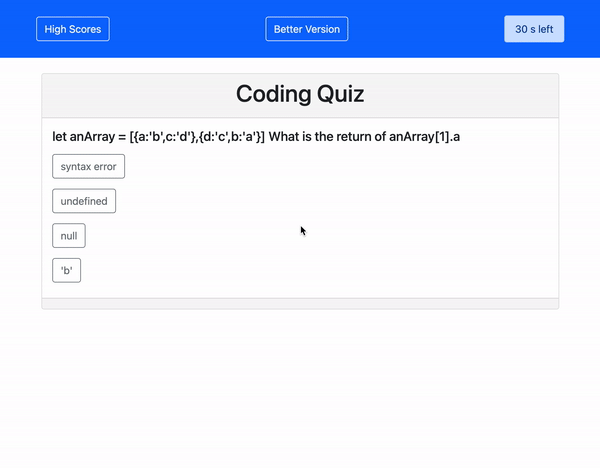
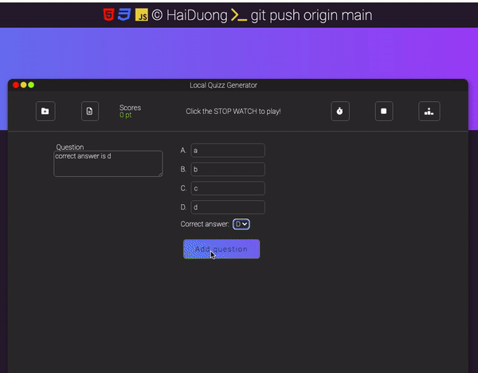

# code-quiz

### Author: Hai Duong
#### Demo link: [caubenondo.github.io/code-quiz](https://caubenondo.github.io/code-quiz/)

### Description
This application will let users to quiz themselves at limited time, with the question bank that they create.

### Play the Game
1. Click on the start button
2. The counter will start to count down from 30s
3. The app will prompt you a random question and its 4 answers from question bank
4. If you select the right answer, you will move to next question without penaty
5. If you select wrong answer, your timer will -5s
6. You collect point by answer as many questions as you can in limited time
8. Once the counter reaches 0 or no question left in queue, the app will show your points and ask you for your name 
9. Then the app will show you the scoreboard
10. The scoreboard display players' ranks sorted by scores

### App in Action

#### More complex version: [Dynamic Quiz](https://github.com/caubenondo/local-quiz-generator)

